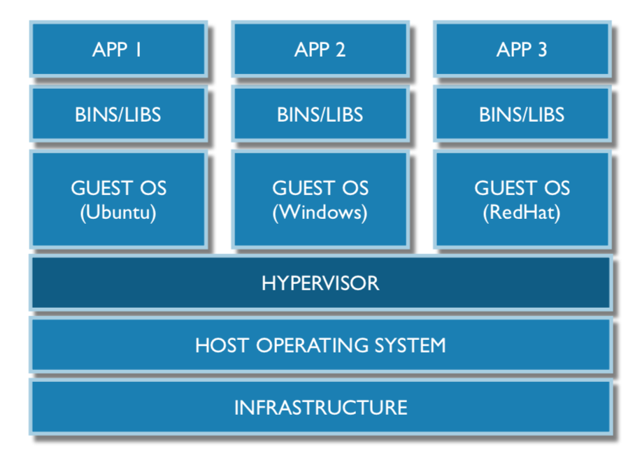
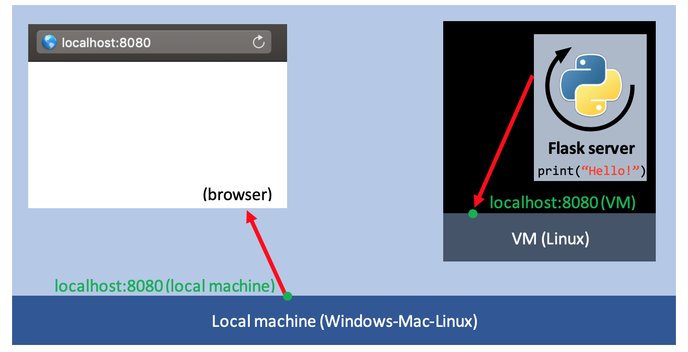
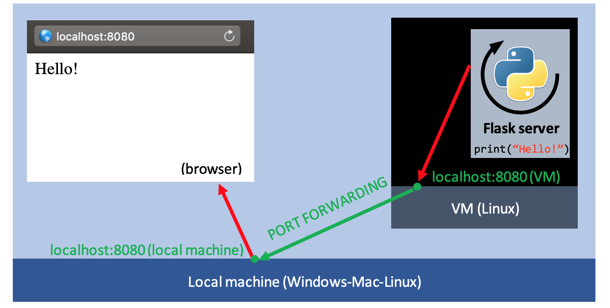

# COMPUTER SCIENCE REFRESHER

This document contains an intuitive explanation of some elemental Computer Science concepts that are used in the course. It is intended as a 'live' document, completed each time a student has a doubt about a concept.

## Contents of the document:

#### 1 - [Computing Basics](#1---computing-basics)
#### 2 - [Networking basics](#2---networking-basics)

# 1 - Computing Basics
This part will have a (very) basic overview of the parts of a computer.

## 1.1 Basic hardware components
To understand why the software works the way it does, it can be useful to understand the main 'physical' components of a computer: the CPU, the Hard Drive, and the RAM. A very basic overview is explained below.

Also: this [5-minute video from TED-Ed](https://www.youtube.com/watch?v=p3q5zWCw8J4) explains it amazingly well.

### 1.1.1 The CPU
CPU stands for 'Central Processing Unit', and acts as the 'brain' of the computer. It is responsible for running the software and performing the data manipulation in the computer. The CPUs installed in modern computers are optimized to be versatile and run many kinds of processes in parallel. 

Note: A 'process' or a 'thread' is the elementary component of processing. Single programs can run multiple processes at a time. To get the intuition: a very simple python `for` loop, for example, where data is computed as a sequence, is a single process.

### 1.1.2 The Hard Drive
The hard drive is the 'long-term' storage of computers. It allows data to be saved in a persistent way, so it is not lost if the machine is turn off; the problem with it is that accessing the data is pretty slow (that is when RAM becomes useful). Data such as Software packages, Photos, or Music is stored in the Hard Drive.

Hard Drives can usually be of two types:
- HDD (hard disk drives), which store data by changing the magnetic orientation of crystals of a rotating disk,
- and SSD (solid state drices), such as USBs, which store data in a series of switches (transistors) that can be 'on' (1) or 'off' (0).

### 1.1.3 The RAM
RAM stands for 'Random Access Memory' in reference of the way the data is stored on it, as any bit of information can be retrieved in any order (as opposed to a Hard disk drive, where the needle needs to physically switch between positions). The killer feature of the RAM is that the data can be accessed really fast (around 50-100 times faster than a typical SSD Hard Drive, and 100,000 times faster than an HHD), although the data is usually lost when the machine is turned off. 

RAM is used to speed up processes: typically, when a software is launched, it will load the data (for example, all of the variables created in a Python script) so that the CPU can do its computations quickly. Browsers also use the RAM to store the data they received from the internet, such as images and HTML files, so they do not overload the network by requesting it each time the user opens the browser tab.

#### What does 'Caching' mean?
'Caching' is a term used in Computer Science that simply means 'Storing in RAM', so it can be accessed faster.

#### What does 'saving the state' mean?
'Saving the state' of a machine simply means saving some of the contents of the RAM into the Hard Drive, so it can be recovered later. The data we usually save is an 'intermediate step' of computation stored in the RAM that we want to recover later. It is called the 'state' since it is not recoverable if lost; when saved in the Hard drive, it becomes recoverable.

Docker containers, for example, always start from a 'saved state' of a previously generated container (which has the software we want already installed and running), so that desired packages are launched as fast as possible.

### 1.1.4 Other components
Computers have many other components, such as the Mother Board, which connects the three components mentioned above (CPU, RAM, and Hard Disk), and other components such as GPU (or 'Graphics Processing Unit) to process media; but these are far beyond the scope of what is needed to understand for the course.

## 1.2 Software components
This part overviews how the software controls the hardware. The goal of this part is to understand very basically how a computer is controlled, and explain what a Virtual Machine (VM) is. For that, we need to intuitively understand what is the kernel, and an hypervisor.

### 1.2.1 The kernel
In a nutshell, the 'kernel' is the central software that manages the computer's limited resources (CPU, RAM, Hard Drive), and allocates them to processes. It can be considered as the 'core of the Operating System'.

A bit more precisely, in a Unix system, the kernel is responsible of the following tasks:
- Process scheduling: it decides how the multiple processes use of the CPU of the machine.
- Memory management: the kernel also handles the use of the RAM by each process. It will keep track of which parts of the RAM are used by which process, and make sure that two different processes do not modify the data of one another.
- Provision of a file system: a way of storing data on the Hard Disk (translating from 1s and 0s to treatable documents)
- Creation and termination of processes: the kernel loads a new process into RAM and provides the resources it needs (CPU, memory, access to files) once the process is run; once the process is terminated, the kernel ensures the resources used by it are freed again.
- Access to devices: the kernel manages the access to computer devices (keyboard, mouse, disks, etc.) by the running processes.
- Network: it sends and receives networking packets on behalf of the processes.

### 1.2.2 Hypervisors and VMs
#### Hypervisors
Each operating system has its own 'language', and its way of talking to devices. A **hypervisor** is simply a 'translator layer' that allows a Host Operating System be run in any computer, believing it runs in a physical device (although it doesn't). To achieve this, hypervisors perform two main tasks:
- They allocate computer resources (CPU, RAM and Hard Disk) so that only virtual machine can use them. It achieves this by 'partitioning' (or splitting) them: one 'slice' for the Host OS, and another for the VM (For example, a RAM of 8GB might be split in 4GB for the Host OS, and 4GB for the VM).
- 'Translating' orders from one operating system to another. For example, if we emulate a UNIX operating system (as we will do on the course), it will try to talk to the hardware using a 'language' that Windows or MAC Operating Systems might not understand. Hypervisors 'translate' UNIX commands (such as 'give me 10MB of RAM for this process') so that a Windows or a MAC operating system can understand it and perform that task, in such a way so that the UNIX system believes that is running in an actual computer (although it is not).

#### Virtual Machines (VMs)
Virtual Machines are simply an emulation of an operating system that believes it runs in an isolated physical device, but it is really running inside another computer thanks to a hypervisor. Let's visualize it with the below diagram:



Boxes represent different layers of complexity, talking to each other. The 'Host OS' (kernel) layer manages the Infrastructure (CPU, RAM, etc.), the Hypervisor talks to the Host OS, creating three 'encapsulations' (divisions of the Infrastructure) and 'translating' the Host OS commands to Native Linux (Ubuntu), Windows, and RedHat (top layers of the example.)

##### Why are VMs useful at all?
VMs are used in DevOps (as well as containers) to create a replicable evironment (such as a UNIX system), so that any member of the team can re-create it without problem and work on it, to avoid the "it seems to only work on your computer" kinds of problem. In the Class, we will use `Vagrant` to create the specifications of the VM we want to start.

VMs are one of the keys in the revolution of Cloud Computing: all instances ran in the Cloud are actual VMs running somewhere in a Data Center. Thanks to them, computing has become much more efficient, saving billions. Now, instead of having to buy a physical computer to run a server, multiple servers are 'squished' into a single computer thanks to virtualization in a 'pay-for-what-you-need' business model.


# 2 - Networking Basics
In this course, we will be running a server, and use a nice trick called 'port-forwarding' to access the outputs of the server running inside a VM. For that, we need to understand some very basics of Networking, such as what are IPs, ports, as well as how HTML (the way servers talk to browsers) works.

## 2.1 IPs and Ports
### 2.1.1 IP addresses
An IP ('Internet Protocol') address is a unique identifyer of a 'node' on the internet graph (a point that can receive and send information), composed of four 8-bit numbers. IPs are used to specify who should receive a specific chunk of data (called 'packet').
IPs can be public (a unique number, used to communicate with the web) or private (which means it is only accessible locally). An example of a private IP address is `127.0.0.1`, which is known as `localhost` by default. In the course, we will run a 'local' version of the server on our machine on IP `127.0.0.1`, which the browser can access when the IP address or its shortcut are visited.

#### What does a 'local' version of the server mean?
It means that the process (all computations) run by the server will be done in our local device, and the outputs of the server (called 'server responses') will only be accessible locally. This is usually used to debug the server and ensure it behaves as it should. Once some basic functionalities are coded and tested, we can run it in the Cloud (in a Virtual Machine in some Data Center, where a public IP will be given to it) so that we can access it from anywhere in the world.

### 2.1.2 Ports
The 'port' is simply a 16-bit number (which complements the IP address), to organize the type of data sent and received by a machine. Port numbers from 0 to 1023 are pre-assigned (by convention) to frequently used communications; for example, port `80` is used for the `HTTP` protocol (by default, browsers 'listen' to port 80 for data and ignore the rest). Port `22` is used for the `SSH` protocol. In this course, we will run applications, and direct their outputs into ports (which we will set to large numbers such as `8080` to avoid using a predefined number).

#### What is 'port forwarding'?
'Port forwarding' is a trick we will use to communicate with a server running in a Virtual Machine.

In our project, we will run a VM running UNIX (which will be controlled using a terminal). On the VM, we will run a server that will listen to requests (inputs), and send back responses (outputs) to an IP and port of our choice (let's say `localhost:8080`). 

To test the server, we want to be able to communicate with it though our browser locally (by opening the browser and going to the `localhost:8080` address). However, this will not work, since the server will be running inside of the VM, and our browser will 'listen' inside of our local machine. Let's explain it with a visual example:



The above diagram shows the local machine (light-blue), inside of which runs a browser tab and a VM (black box); inside the VM, a Flask server is running and sending its outputs to the `localhost:8080` inside the VM (represented by the red arrow). The green dot represents the virtual address `localhost:8080` in the VM (which is where the data From the server is sent). The browser, then, when the address `localhost:8080` is requested, will try to communicate with the `localhost:8080` of the local machine (Not the VM!), represented by the other green dot. Both dots are not connected, therefore we cannot access the server! Here is when 'port forwarding' comes handy (represented by the green arrow):



Port forwarding means asking the VM to foward any traffic of data received on its `localhost:8080` to the `localhost:8080` of the local device (represented by the green arrow), hence connecting the browser and the server running inside the VM. We can now access our server!

## 2.2 HTTP protocol
`HTTP` stands for 'Hypertext Transfer Protocol', which is used to send and receive data through the internet. It is the language used by servers and browsers to communicate as well. HTTP codifies the messages sent by clients (ex: a browser) in a structured manner, so that servers can understand what the client is asking for, and send a response to it.

### 2.2.1 HTTP requests
[This file](request.txt) contains an example of the request sent by Google Chrome while trying to reach the address `localhost:3000`. (To get this file, a server which simply logs the requests received in `localhost:3000` was created).

As we can see, there is a lot of information in a request (a lot of empty fields), some private data (such as the Computer and browser used by the client), but most importantly, the **URL** (in the example provided, the URL is `'/'`, or the 'home' URL), and the **HTTP Method** (a `GET` request in the example, since the client is simply requesting the server to 'read' the `'/'` URL).

#### What are URLs and HTTP Methods used for?
A server needs two fields to know how to process a request: the **HTTP method** (`GET`, `POST`, `PUT`, `DELETE`, etc.), and the **URL** (always `'/<something>'`). Once the server knows both fields, it will know which functions on the backend to trigger to prepare a response back to the client. In other words, it is the way we structure the servers. Each combination of valid HTTP method and URL should trigger a function of our server.

For example, a `GET` request to the home URL `'/'` should trigger the function that sends the client the contents of home page (which is usually a static HTML file with a nice display). 
 
In this course, **URLs** and **HTTP methods** will follow a convention called the `RESTful API`.

Note: The most frequently used HTTP methods are `GET` (read data), `PUT` (update some data on the server), `POST` (send some data on the server to create a resource), and `DELETE` (delete some resource). We will other HTTP methods in the `RESTful API` lecture.

#### Headers and body of the request
All HTTP messages have two main components: the **header** and the **body**. 

The **header** should store two or three key pieces of data (depending if we are sending data to the server or not):
- The HTTP method (explained above)
- The URL requested (explained above)
- The `Content-Type`: which is required only when the HTTP method is `POST` or `PUT`. This field allows the server to know which type of data the client is sending. (example: setting `Content-Type: application/json` will let the server know we are sending a JSON object).

The **body** contains the data the client is sending (example: a JSON object).

### 2.2.2 HTTP responses
Once the server has treated a request, it should send a response to the client; responses can have many forms, and are sent in a similar object as the request. The two main components a response must contain are the **header** and the **body**.

#### The response header
The **header** contains information about the message itself; the minimum information required for a valid response are the following two fields: 
- the `Content-Type`: which states the format used on the body of the message (so that the client can decode it). For example, setting `Content-Type` to `application/json` (on the header: `Content-Type: application/json`) will let the client know that the message sent back is in JSON format.
- the `Status`: which tells the client information about how the server handled the request. For example, `200 OK` tells the client the server properly understood the request, and sent back an appropriate response. If something went wrong, the `Status` would be set to the appropriate error code. Find the entire list [here](https://developer.mozilla.org/en-US/docs/Web/HTTP/Status).

#### The body of the response
The **body** is the content of the message the server wants to send back to the client. It can have many formats: plain text, HTML, JSON... The browser understands those languages and will render the response accordingly.

### 2.2.3 the `JSON` format
JSON stands for 'JavasCript Object Notation', which is a type of very commonly used format to send data through HTTP (since browsers understand `JavaScript`). JSON objects are very similar to Python dictionnaries: the data is stored in a structured way by slicing it in a set of keys.

#### How does a JSON object look like?
Imagine we are a client that wants to purchase a music instrument. The client will send a request to the server to buy that product. (For simplicity, let's say the server only requires two fields to identify the product and process its purchase: the `product_name` and its `id_number`). The **body** of the message the browser will send is shown below:
```JSON
{
    "product_name": "Höfner bass",
    "id_number": 123456
}
```
- The object above is in JSON format, and the server will easily retrieve the fields it needs (as simple as that).


### 2.3 SSH
SSH stands for 'Secure Shell' protocol. It is an encrypted protocol (for security reasons) that allows a machine to take control over another machine. In the course, we will use the SSH protocol to control and run commands on the Virtual Machines we create with Vagrant.
